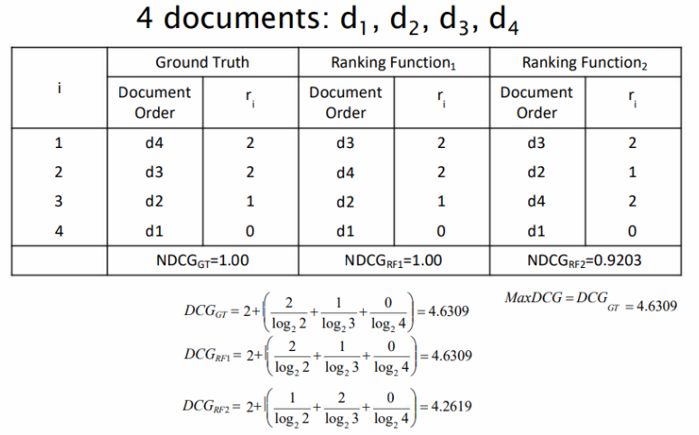

<!-- XXXXXXXXXXXXXXXXXXXXXXXXXXXXXXXXXXXXXXXXXXXXXXXXXXXXXXXXXXXXXXXXXXXXXXXXXXXXXXXXXXXXXXXXXXXXXXXXXXXX -->

## ESERCIZIO - Mosra un esempio di Precision e di Recall (livelli naturali e standard).

#### QUESITO

Mostra un esempio di precision e di recall ai diversi livelli di recall, sia naturali sia standard.

#### FORMULA

$$ P(r_j) = \max_{r_j \hspace{2pt} \leq \hspace{2pt} r \hspace{2pt} \leq \hspace{2pt} r_{j+1}} P(r) $$

#### RISPOSTA

Esempio precision e recall a livelli **naturali** di recall:

- $R_{\text{documenti rilevanti}} = \{doc3, doc56, doc124\}$

- $A_{\text{documenti restituiti}} = \{\underline{doc56}, doc1, doc15, doc100, \underline{doc3}, ..., \underline{doc124}\}$

    |Recall|Precision| 
    |:---:|:---:|
    |0.33|1.0|
    |0.66|0.4|
    |1.0 |0|

Esempio di precision e recall a livelli **standardizzati** di recall (*post interpolazione*):

|Recall|Interpolated Precision| 
|:---:|:---:|
|1.0|0|
|0.9|0|
|0.8|0|
|0.7|0|
|0.6|0.4|
|0.5|0.4|
|0.4|0.4|
|0.3|1.0|
|0.2|1.0|
|0.1|1.0|
|0.0|1.0|

#### FINE

<!-- XXXXXXXXXXXXXXXXXXXXXXXXXXXXXXXXXXXXXXXXXXXXXXXXXXXXXXXXXXXXXXXXXXXXXXXXXXXXXXXXXXXXXXXXXXXXXXXXXXXX -->

## ESERCIZIO - Mosra i valori di Precision e di recall naturali rispetto ad un ranking dato.

#### QUESITO

Mostra i valori di precision e di recall naturali dato il seguente ranking.

- $R_{\text{documenti rilevanti}} = \{d3, d5, d9, d25, d39, d44, d56, d71, d389, d123\}$, $|R| = 10$
- $A_{\text{documenti restituiti}} = \{\underline{d123}, d84, \underline{d56}, d6, d8, \underline{d9}, d511, d129, d187, \underline{d25}, d36, d48, d250, d113, \underline{d2}\}$, $|Ra| = 5$

#### RISPOSTA

|Recall|Precision| 
|:---:|:---:|
|0.0|??%|
|0.1|100%|
|0.2|66%|
|0.3|50%|
|0.4|40%|
|0.5|33%|
|0.6|0%|
|0.7|0%|
|0.8|0%|
|0.9|0%|
|1.0|0%|

#### FINE

<!-- XXXXXXXXXXXXXXXXXXXXXXXXXXXXXXXXXXXXXXXXXXXXXXXXXXXXXXXXXXXXXXXXXXXXXXXXXXXXXXXXXXXXXXXXXXXXXXXXXXXX -->

## ESERCIZIO - Mosra un esempio di Average Precision (Level).

#### QUESITO

Mostra un esempio di applicazione della formula di Average Precision (AP) per il livello di recall r.

#### RISPOSTA

Supponiamo di avere **2 query** ($\mathbf{N_q = 2}$) e vogliamo calcolare l'AP al livello $\mathbf{r = 0.3}$.

**Passo 1: Calcolare la precisione interpolata $\mathbf{P_q(0.3)}$ per ogni query**

- Query 1: $P_1(0.3) = 0.75$
- Query 2: $P_2(0.3) = 0.50$

**Passo 2: Applicare la formula di $\mathbf{AP(r)}$**

$$ AP(0.3) = \frac{1}{N_q} \cdot \sum_{i=1}^{N_q} AP_{q_i}(0.3) $$

$$ AP(0.3) = \frac{1}{2} \cdot (0.75 + 0.50) = \frac{1.25}{2} = 0.625 $$

**Risultato**

L'Average Precision al livello $r = 0.3$ è $0.625$ per questo insieme di query.

Questo valore rappresenta la media della precisione interpolata al livello $r = 0.3$ sulle query considerate.

#### FINE

<!-- XXXXXXXXXXXXXXXXXXXXXXXXXXXXXXXXXXXXXXXXXXXXXXXXXXXXXXXXXXXXXXXXXXXXXXXXXXXXXXXXXXXXXXXXXXXXXXXXXXXX -->

## ESERCIZIO - Mosra un esempio di Average Precision (Query) + MAP.

#### QUESITO

Mostra un esempio di applicazione della formula di Average Precision (AP) per per la query q. Successivamente mostra un esempio di applicazione della funzione MAP (Mean Average Precision).

#### RISPOSTA

1. **ESEMPIO AVERAGE PRECISION**

    Supponiamo di avere **1 query** e di considerare **3 livelli standard di recall** $\mathbf{n = 3}$.

    **Passo 1: Calcolare le precisioni interpolate $\mathbf{P_q(3)}$ ai vari livelli di recall**

    - Livello $r = 0.1$: $P_q(0.1) = 0.8$
    - Livello $r = 0.2$: $P_q(0.2) = 0.6$
    - Livello $r = 0.3$: $P_q(0.3) = 0.4$

    **Passo 2: Applicare la formula di $\mathbf{AP(q)}$**

    $$ AP(q) = \frac{1}{n} \cdot \sum_{r = 1}^n P_q(r) $$

    $$ AP(q) = \frac{1}{3} \cdot (0.8 + 0.6 + 0.4) = \frac{1.8}{3} = 0.6 $$

    **Risultato**

    L'Average Precision per la query $q$ è $0.6$.

    Questo valore rappresenta la media della precisione interpolata ai vari livelli di recall standard per la query.

2. **ESEMPIO APPLICAZIONE MAP**

    Supponiamo di avere **2 query**$.

    **Passo1: Calcolare le precisioni medie di ciascuna query.**

    - Query 1: $AP(q_{1}) = 0.6$
    - Query 2: $AP(q_{2}) = 0.4$

    **Passo2: Applicare la formula di $\mathbf{MAP([q1, q2])}$**

    $$ MAP(Q) = \frac{1}{|Q|} \cdot \sum_{q \in Q} AP(q) $$

    $$ MAP([q_1, q_2]) = \frac{1}{2} \cdot (0.6 + 0.4) = \frac{1.0}{2} = 0.5 $$

    **Risultato**

    L'Average Precision Media per le query $q_1$ e $q_2$ è $0.5$.

    Questo valore rappresenta la media delle precisioni medie; utile come singolo valore da confrontare con quello ricavato dallo studio di altri sistemi.

#### FINE

<!-- XXXXXXXXXXXXXXXXXXXXXXXXXXXXXXXXXXXXXXXXXXXXXXXXXXXXXXXXXXXXXXXXXXXXXXXXXXXXXXXXXXXXXXXXXXXXXXXXXXXX -->

## ESERCIZIO - Mosra un esempio di R-Precision.

#### QUESITO

Mostra un esempio di R-Precision.

#### RISPOSTA

**Supponiamo che per una query otteniamo i seguenti primi 3 risultati ($\mathbf{R = 3}$):**

- $A_{\text{documenti restituiti}} = \{\underline{DocA}, DocB, \underline{DocC}\}$

**Passo 1: Calcolo della R-Precision**

$$ \text{R-Precision} = \frac{\text{\# risultati rilevanti tra i primi R restituiti}}{R} $$

$$ \text{R-Precision} = \frac{2}{3} \approx 0.667 $$

**Risultato**

Il valore di precision considerando solamente i primi tre risultati ($R = 3$) è $0.667$.

#### FINE

<!-- XXXXXXXXXXXXXXXXXXXXXXXXXXXXXXXXXXXXXXXXXXXXXXXXXXXXXXXXXXXXXXXXXXXXXXXXXXXXXXXXXXXXXXXXXXXXXXXXXXXX -->

## ESERCIZIO - Mosra un esempio di Discounted Cumulative Gain (DCG).

#### QUESITO

Mostra un esempio di Discounted Cumulative Gain (DCG) che mostri il guadagno cumulativo.

#### RISPOSTA

**Supponiamo di avere 5 documenti classificati con i seguenti livelli di rilevanza:**

- $R_{\text{documenti rilevanti}} = \{3, 2, 3, 0, 1\}$, $|R| = 5$

**Passo1: Costruiamo una tabella calcolando il guadagno scontato per ciascun documento:**

$$ DCG_p = rel_1 + \sum_{j=2}^p \frac{rel_j}{\log_2(j)} $$

|Pos $j$|Rilevanza $rel_j$|Sconto $\log_2(j)$|Discounted Gain $\frac{rel_j}{\log_2(j)}$ 
|:---:|:---:|:---:|:---:|
|1|3|1.00|3.00|
|2|2|1.00|2.00|
|3|3|1.59|1.89|
|4|0|2.00|0.00|
|5|1|2.32|0.43|

**Passo2: Calcoliamo la DCG cumulativa sommando progressivamente i valori della colonna Discounted Gain.**

- $DCG_5 = [3, 5, 6.89, 6.89, 7.32]$ 

#### FINE

<!-- XXXXXXXXXXXXXXXXXXXXXXXXXXXXXXXXXXXXXXXXXXXXXXXXXXXXXXXXXXXXXXXXXXXXXXXXXXXXXXXXXXXXXXXXXXXXXXXXXXXX -->

## ESERCIZIO - Mosra un esempio di Normalized Discounted Cumulative Gain (NDCG).

#### QUESITO

Mostra un esempio di Normalized Discounted Cumulative Gain (NDCG) relativa ad una Ideal Discounted Cumulative Gain (IDCG).

#### RISPOSTA

$$ NDCG_p = \frac{DCG_p}{IDCG_p} $$

#### FINE