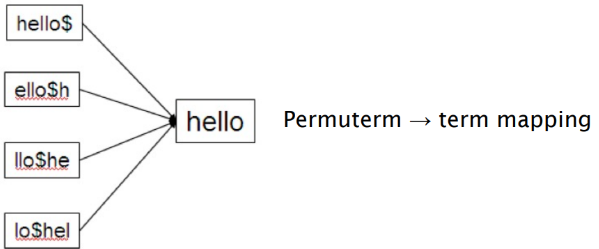
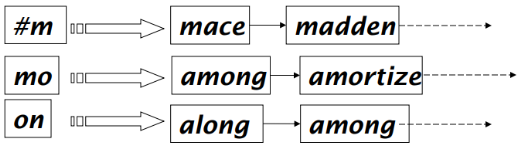
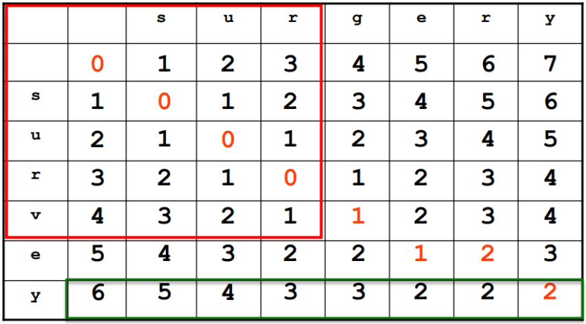

<!-- XXXXXXXXXXXXXXXXXXXXXXXXXXXXXXXXXXXXXXXXXXXXXXXXXXXXXXXXXXXXXXXXXXXXXXXXXXXXXXXXXXXXXXXXXXXXXXXXXXXX -->

## ESERCIZIO - PERMUTERM INDEX - Data una parola, mostra tutti i suoi permuterm, e disegna il permuterm-index.

#### QUESITO

Mostra un esempio di indice Permuterm per la parola "hello", includendo tutti i permuterm e disegnando l'indice corrispondente.
Fornisci esempi di query con caratteri jolly (wildcard), utilizzando la wildcard speciale "*" e la parola "hello".

#### RISPOSTA

**Passo 1:**
- **Creazione dei permuterm di "hello" $\rightarrow$ Un permuterm è una rotazione della parola con un simbolo speciale "$" aggiunto alla fine. Ecco i permuterm per "hello":**

    - hello$
    - ello$h
    - llo$he
    - lo$hel
    - o$hell
    - $hello

**Passo2:**
- **Permuterm Index $\rightarrow$ L'indice Permuterm memorizza tutte le rotazioni della parola "hello" all'interno di un B-Tree; ogni rotazione punta alla parola da cui è stata originata nel dizionario dell'Inverted Index, in questo caso "hello":**

    

**Passo3:**

- **Elaborazione delle wildcard queries: Le query con wildcard vengono trasformate per essere risolte come prefix queries, seguendo queste regole:**

    - X     $\rightarrow$ Ricerca X\$    $\hspace{30pt}$ (es. hello   $\rightarrow$ hello\$)
    - X\*   $\rightarrow$ Ricerca \$X\*  $\hspace{23pt}$ (es. hel\*   $\rightarrow$ \$hel\*)
    - \*X   $\rightarrow$ Ricerca X\$\*  $\hspace{23pt}$ (es. \*lo    $\rightarrow$ lo\$\*)
    - \*X\* $\rightarrow$ Ricerca X\*    $\hspace{25pt}$ (es. \*ell\* $\rightarrow$ ell\*)
    - X\*Y  $\rightarrow$ Ricerca Y\$X\* $\hspace{14pt}$ (es. hel\*o  $\rightarrow$ o\$hel\*)

#### FINE

<!-- XXXXXXXXXXXXXXXXXXXXXXXXXXXXXXXXXXXXXXXXXXXXXXXXXXXXXXXXXXXXXXXXXXXXXXXXXXXXXXXXXXXXXXXXXXXXXXXXXXXX -->

## ESERCIZIO - Q-GRAM INDEX - Elenca i q-grammi di una parola; costruisci un q-gram index; procedura di ricarca tramite wildcard queries.

#### QUESITO

1) Mostra tutti i q-grammi estratti da una parola a scelta.
2) Disegna il q-gram index di una parola a scelta.
3) Descrivi il processo di ricerca tramite WildCards.

#### RISPOSTA

**Parte 1: Esempi di esplicitazione di q-grammi:**

 1. Consideriamo la parola ***"vacations"*** con **q = 3** (trigrammi):
    - $\{\#\#v, \#va, vac, aca, cat, ati, tio, ion, ons, ns\$, s\$\$\}$

 2. Per la frase ***"April is the cruelest month"*** con **q = 2** (bigrammi):
    - $\{\#a, ap, pr, ri, il, l\$, \#i, is, s\$, \#t, th, he, e\$, \#c, cr, ru, ue, el, le, es, st, t\$, \#m, mo, on, nt, th, h\$\}$

**Parte 2: Costruzione del q-gram index per la parola "moon":**

**Parte 3: La procedura di ricerca tramite wildcard queries consiste in questi passaggi:**

1. **Per elaborare una wildcard query, la parola viene suddivisa in q-grammi;**
    - *Query: **"mon\*"***;
    - *Q-grammi: $\{\#m, mo, on\},\text{ con q = 2}$*,
2. **Si esegue un AND tra questi q-grammi per recuperare tutte le parole che contengono questa sequenza;**
    - es. *"monaco", "monitor", "money", "moon", ecc*.
3. **Successivamente, viene applicato un post-filtraggio per eliminare i falsi positivi;**
    - es. *"moon" potrebbe apparire nei risultati perchè contiene "mo" e "on"*.
4. **I termini validi vengono poi usati per cercare i documenti nell’indice invertito principale;**

#### FINE

<!-- XXXXXXXXXXXXXXXXXXXXXXXXXXXXXXXXXXXXXXXXXXXXXXXXXXXXXXXXXXXXXXXXXXXXXXXXXXXXXXXXXXXXXXXXXXXXXXXXXXXX -->

## ESERCIZIO - EDIT DISTANCE - Formula di programmazione dinamica; Esempio di Edit Distance; Tabella di ottenimento Edit Distance.

#### QUESITO

1) Descrivi la formula di programmazione dinamica;
2) Mostra un esempio di Edit Distance rispetto a due parole a scelta;
3) Disegna la tabella che consente di ottenere la edit distance tra le due parole.

#### RISPOSTA

**Parte 1: Formula di programmazione dinamica** $\rightarrow$ La **distanza di Levenshtein** (Edit Distance) tra due parole si calcola come il numero minimo di operazioni (inserimento, cancellazione, sostituzione) necessarie per trasformare una parola nell'altra:

Casi base:
$$ C_{i,0} = i, \hspace{15pt} C_{0,j} = j $$
Passo ricorsivo:
$$ C_{i,j} = \begin{cases}
    C_{i-1,j-1}                                 & \text{se } x_i = y_j \\
    1 + \min(C_{i-1,j}, C_{i,j-1}, C_{i-1,j-1}) & \text{altrimenti}
\end{cases} $$

**Parte 2 e 3: Esempio di Edit Distance**

- **Esempio 1: Edit Distance rispetto a "kitten" e "sitting" e rispettiva tabella:**

    |       |   | k | i | t | t | e | n |
    |-------|---|---|---|---|---|---|---|
    |       | 0 | 1 | 2 | 3 | 4 | 5 | 6 |
    | **s** | 1 | 1 | 2 | 3 | 4 | 5 | 6 |
    | **i** | 2 | 2 | 1 | 2 | 3 | 4 | 5 |
    | **t** | 3 | 3 | 2 | 1 | 2 | 3 | 4 |
    | **t** | 4 | 4 | 3 | 2 | 1 | 2 | 3 |
    | **i** | 5 | 5 | 4 | 3 | 2 | 2 | 3 |
    | **n** | 6 | 6 | 5 | 4 | 3 | 3 | 2 |
    | **g** | 7 | 7 | 6 | 5 | 4 | 4 | 3 |

    **Risultato**: La distanza di edit tra "kitten" e "sitting" è $3$ (due sostituzioni e un'inserimento).

- **Esempio 2: Edit Distance rispetto a "surgery" e "survey" e rispettiva tabella:**

    

    **Risultato**: La distanza di edit tra "surgery" e "survey" è $2$ (una sostituzione e una rimozione).

#### FINE

<!-- XXXXXXXXXXXXXXXXXXXXXXXXXXXXXXXXXXXXXXXXXXXXXXXXXXXXXXXXXXXXXXXXXXXXXXXXXXXXXXXXXXXXXXXXXXXXXXXXXXXX -->

## ESERCIZIO - Q-GRAM OVERLAP - Determina il grado di sovrapposizione tra due parole date. Descrivi le fasi del processo di Q-Gram Overlap con Q-Gram Index.

#### QUESITO

1) Determina il grado di sovrapposizione dei q-grammi tra due parole.
2) Descrivi le fasi del processo di Q-Gram Overlap con Q-Gram Index.

#### RISPOSTA

Confronto tra "december" e "november", con $q = 3$:

- Trigrammi di "december" $\rightarrow \{\#\#d, \#de, dec, ece, cem, emb, mbe, ber, er\$, r\$\$\}$
- Trigrammi di "november" $\rightarrow \{\#\#n, \#no, nov, ove, vem, emb, mbe, ber, er\$, r\$\$\}$
- Overlap tra i due termini: $\rightarrow \{emb, mbe, ber, er\$, r\$\$\}$

Dati ottenuti:
- Numero di trigrammi in comune: $5$
- Numero totale di trigrammi distinti: $15$

Per quantificare il grado di sovrapposizione tra due insiemi di q-grammi, si utilizza il **coefficiente di Jaccard**, definito come:

$$ \text{J}(A,B) = \frac{|A \cap B|}{|A \cup B|} $$

Quindi:

$$ \text{J}(\textit{december}, \text{november}) = \frac{5}{15} = 0.333 $$

#### FINE

<!-- XXXXXXXXXXXXXXXXXXXXXXXXXXXXXXXXXXXXXXXXXXXXXXXXXXXXXXXXXXXXXXXXXXXXXXXXXXXXXXXXXXXXXXXXXXXXXXXXXXXX -->

## ESERCIZIO - ADVANCED Q-GRAM FILTERING - Per ogni metodo di filtraggio visto, descrivi la rispettiva formula e fai un esempio.

#### QUESITO

Per ogni metodo di filtraggio visto, descrivi la rispettiva formula e fai un esempio.

#### RISPOSTA

1. **Length Filter**

    Il **filtro di lunghezza** esclude le coppie di stringhe la cui differenza di lunghezza è maggiore di una soglia di errore $k$. Se la differenza di lunghezza tra le due stringhe è superiore a $k$, allora la distanza di Edit (ED) sarà sicuramente maggiore di $k$, quindi non c'è bisogno di calcolare l'Edit Distance.

    **Formula:**

    $$|len(S_1) - len(S_2)| > k \hspace{10pt}\implies\hspace{10pt} ED(S_1, S_2) > k$$

    **Esempio:**
    
    - Stringa 1: "kitten" (lunghezza = 6)
    - Stringa 2: "dog" (lunghezza = 3)

    La differenza di lunghezza è $|6 - 3| = 3$. Se $k=2$, possiamo scartare questa coppia di stringhe, perché la differenza di lunghezza è maggiore di $k$, e quindi $ED(S_1,S_2) > 2$.

2. **Count Filter**

    Il **filtro di conteggio** confronta la frequenza dei q-grammi comuni nelle due stringhe. Se il numero di q-grammi comuni è troppo basso rispetto al totale dei q-grammi delle stringhe, la somiglianza è improbabile e la coppia di stringhe può essere scartata.

    **Formula:**

    $$ \textbf{Comuni} = |G_1 \cap C_2| $$

    **Esempio:**

    - Stringa 1: "kitten" $\rightarrow$ (con $q=2$): "ki", "it", "tt", "te", "en"
    - Stringa 2: "sitting" $\rightarrow$ (con $q=2$): "si", "it", "tt", "ti", "in", "ng"

    I q-grammi comuni sono: "it", "tt". Se la soglia $t=2$ (almeno 2 q-grammi comuni), possiamo continuare a calcolare l'Edit Distance. Se i q-grammi comuni fossero meno di 2, le stringhe potrebbero essere scartate.

3. **Position Filter**

    Il filtro di posizione prende in considerazione la distribuzione dei q-grammi nelle stringhe. Anche se due stringhe hanno gli stessi q-grammi, se la loro distribuzione è troppo diversa (ad esempio, i q-grammi sono disposti in posizioni troppo distanti), è improbabile che le due stringhe siano simili.

    **Formula:**

    Per ogni q-grammo $g$ in $S_1$ e $S_2$​, calcoliamo la distanza tra le posizioni in cui appare in ciascuna stringa. Se la distanza media tra i q-grammi comuni nelle due stringhe è maggiore di una soglia $d$, possiamo scartare la coppia.

    $$ \frac{1}{|G_1 \cap G_2|} \sum_{g \in G_1 \cap G_2} |pos_{S_1}(g) - pos_{S_2}(g)| > d \hspace{10pt}\implies\hspace{10pt} \textbf{scarta la coppia} $$

    **Esempio:**

    - Stringa 1: "kitten" $\rightarrow$ (con $q=2$): "ki", "it", "tt", "te", "en"
    - Stringa 2: "sitting" $\rightarrow$ (con $q=2$): "si", "it", "tt", "ti", "in", "ng"

    Posizioni dei q-grammi comuni (da $S_1$ e $S_2$):

    - "it" è nelle posizioni 2 e 2.
    - "tt" è nelle posizioni 3 e 3.

    Se la distanza media tra le posizioni dei q-grammi comuni è troppo alta, ad esempio maggiore di una soglia $d$, possiamo scartare la coppia. Se le posizioni sono ravvicinate, invece, possiamo continuare con il calcolo dell'Edit Distance.

#### FINE